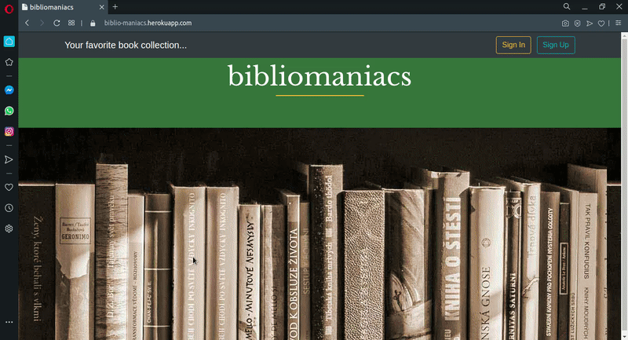

# bibliomaniacs
Create and manage your favorite book collection.

Bibliomaniacs is a Flask desktop App for creating and storing collection of books.
It is based on a previous project called <a href="https://github.com/jplessey/my_Books">my_Books</a>, and this updated version adds new features such as user management (sign up and sign in) and the ability to check the books that the user has already read.
All C.R.U.D. operations can be done to create and manage your own book collection.

You can try bibliomaniacs here: https://biblio-maniacs.herokuapp.com/

#### Main technologies used:
* Flask
* SQLAlchemy
* Jinja2
* Bootstrap4

python_version = 3.8